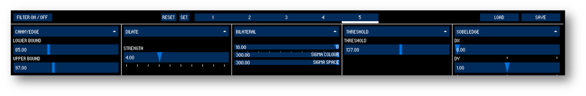

# Double Robot Remote Server

A Java desktop application to remotely control a [Double Telepresence Robot](https://www.doublerobotics.com) and display video from the camera on the robot by communicating with the client over a socket stream.

This appllication allows you to utilized various image processing techniques and the OpenCV library to manipulate the robot camera view to test prototype video effects.

This "server" application works in conjunction with an [iOS "client" application](https://github.com/NickJosephson/Double-Robot-Remote-Client) that resides on the robot to allow this desktop application to controll the robot and receive a video feed from the robot's camera that can be processed on the desktop application.

This is part of a project to prototype robot tele-operation interfaces for visually impaired drivers, to enable this population to benefit from tele-robotics.

